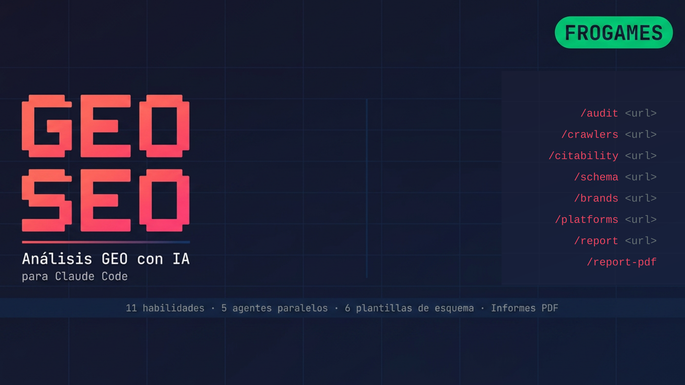

<p align="center">
  
</p>

<p align="center">
  <strong>Prioridad GEO, soporte SEO.</strong> Optimiza sitios web para motores de búsqueda impulsados por IA<br/>
  (ChatGPT, Claude, Perplexity, Gemini, Google AI Overviews) mientras mantienes las bases del SEO tradicional.
</p>

<p align="center">
  La búsqueda con IA está devorando a la búsqueda tradicional. Esta herramienta optimiza hacia donde va el tráfico, no donde solía estar.
</p>
---

## Por qué importa el GEO (2026)

| Métrica | Valor |
|--------|-------|
| Mercado de servicios GEO | $850M+ (proyección de $7.3B para 2031) |
| Crecimiento de tráfico referido por IA | +527% interanual |
| Tasa de conversión de tráfico por IA vs orgánico | 4.4x mayor |
| Gartner: caída del tráfico de búsqueda para 2028 | -50% |
| Menciones de marca vs backlinks para IA | Correlación 3x más fuerte |
| Marketers invirtiendo en GEO | Solo 23% |

---

## Inicio Rápido

### Instalación con un comando (macOS/Linux)

```bash
curl -fsSL https://raw.githubusercontent.com/joanby/geo-seo-claude/main/install.sh | bash
```

### Instalación Manual

```bash
git clone https://github.com/joanby/geo-seo-claude.git
cd geo-seo-claude
./install.sh
```

### Windows (Git Bash)

Requiere [Git for Windows](https://git-scm.com/downloads) que incluye Git Bash.

```bash
# Opción 1: Instalación con un comando (ejecutar desde Git Bash, no PowerShell/CMD)
curl -fsSL https://raw.githubusercontent.com/joanby/geo-seo-claude/main/install-win.sh | bash

# Opción 2: Instalación Manual
git clone https://github.com/joanby/geo-seo-claude.git
cd geo-seo-claude
./install-win.sh
```

> **Nota:** Haz clic derecho en la carpeta y selecciona "Open Git Bash here", o abre Git Bash y navega al directorio. No uses PowerShell ni Símbolo del sistema (CMD).

### Requisitos

- Python 3.8+ (en Debian/Ubuntu también `python3-venv`)
- Claude Code CLI
- Git
- Opcional: [`uv`](https://docs.astral.sh/uv/) — si está presente, el instalador lo usará para una instalación más rápida de las dependencias
- Opcional: Playwright (para capturas de pantalla)

### Instalación Aislada

Las dependencias de Python se instalan en un entorno virtual dedicado en
`~/.claude/skills/geo/.venv/`. Tu instalación de Python del sistema **no** se toca, y
desinstalar la habilidad (skill) elimina el entorno virtual junto con el resto de los archivos.

Los archivos de habilidades y agentes hacen referencia a ese entorno virtual directamente, por lo que la herramienta funciona
independientemente de a qué resuelva `python3` en tu `PATH`.

---

## Comandos

Abre Claude Code y usa estos comandos:

| Comando | Qué Hace |
|---------|-------------|
| `/geo audit <url>` | Auditoría GEO + SEO completa con subagentes en paralelo |
| `/geo quick <url>` | Instantánea de visibilidad GEO de 60 segundos |
| `/geo citability <url>` | Puntúa el contenido según su preparación para ser citado por IA |
| `/geo crawlers <url>` | Verifica el acceso de rastreadores de IA (robots.txt) |
| `/geo llmstxt <url>` | Analiza o genera llms.txt |
| `/geo brands <url>` | Escanea menciones de marca en plataformas citadas por IA |
| `/geo platforms <url>` | Optimización específica por plataforma |
| `/geo schema <url>` | Análisis y generación de datos estructurados |
| `/geo technical <url>` | Auditoría SEO técnica |
| `/geo content <url>` | Evaluación de calidad del contenido y E-E-A-T |
| `/geo report <url>` | Genera reporte GEO listo para clientes |
| `/geo report-pdf` | Genera reporte profesional en PDF con gráficos y visualizaciones |

---

## Arquitectura

```
geo-seo-claude/
├── geo/                          # Orquestador principal de habilidades
│   └── SKILL.md                  # Archivo principal de habilidades con comandos y enrutamiento
├── skills/                       # 13 subhabilidades especializadas
│   ├── geo-audit/                # Orquestación de auditoría completa y puntuación
│   ├── geo-citability/           # Puntuación de preparación para citación por IA
│   ├── geo-crawlers/             # Análisis de acceso de rastreadores de IA
│   ├── geo-llmstxt/              # Análisis y generación del estándar llms.txt
│   ├── geo-brand-mentions/       # Presencia de marca en plataformas citadas por IA
│   ├── geo-platform-optimizer/   # Optimización de búsqueda por IA específica por plataforma
│   ├── geo-schema/               # Datos estructurados para descubribilidad por IA
│   ├── geo-technical/            # Bases de SEO técnico
│   ├── geo-content/              # Calidad de contenido y E-E-A-T
│   ├── geo-report/               # Generación de reportes en markdown listos para clientes
│   ├── geo-report-pdf/           # Reporte profesional en PDF con gráficos
│   ├── geo-prospect/             # Gestión de pipeline de prospectos estilo CRM
│   ├── geo-proposal/             # Autogeneración de propuestas para clientes
│   └── geo-compare/              # Seguimiento de diferencias mensuales y reportes de progreso
├── agents/                       # 5 subagentes en paralelo
│   ├── geo-ai-visibility.md      # Auditoría GEO, citabilidad, rastreadores, marcas
│   ├── geo-platform-analysis.md  # Optimización específica por plataforma
│   ├── geo-technical.md          # Análisis técnico de SEO
│   ├── geo-content.md            # Análisis de contenido y E-E-A-T
│   └── geo-schema.md             # Análisis de marcado de esquema (Schema markup)
├── scripts/                      # Utilidades en Python
│   ├── fetch_page.py             # Extracción y análisis de páginas
│   ├── citability_scorer.py      # Motor de puntuación de citabilidad por IA
│   ├── brand_scanner.py          # Detección de menciones de marca
│   ├── llmstxt_generator.py      # Validación y generación de llms.txt
│   └── generate_pdf_report.py    # Generador de reportes PDF (ReportLab)
├── schema/                       # Plantillas JSON-LD
│   ├── organization.json         # Esquema de Organización (con sameAs)
│   ├── local-business.json       # Esquema de Negocio Local (LocalBusiness)
│   ├── article-author.json       # Esquema de Artículo + Persona (E-E-A-T)
│   ├── software-saas.json        # Esquema de Aplicación de Software
│   ├── product-ecommerce.json    # Esquema de Producto con ofertas
│   └── website-searchaction.json # Esquema de Sitio Web + Acción de Búsqueda
├── install.sh                    # Instalador de un comando
├── uninstall.sh                  # Desinstalador
├── requirements.txt              # Dependencias de Python
└── README.md                     # Este archivo
```

---

## Almacenamiento de Datos

Las habilidades de CRM y reportes (`/geo prospect`, `/geo proposal`, `/geo compare`) almacenan datos de tiempo de ejecución fuera del directorio de Claude Code:

```
~/.geo-prospects/
├── prospects.json              # Datos del pipeline de clientes/prospectos
├── proposals/                  # Documentos de propuestas generadas
│   └── <domain>-proposal-<date>.md
└── reports/                    # Reportes de diferencias mensuales
    └── <domain>-monthly-<YYYY-MM>.md
```

Este directorio **no se elimina** con el desinstalador — bórralo manualmente si ya no necesitas los datos de tus prospectos.

---

## Cómo Funciona

### Flujo de Auditoría Completa

Cuando ejecutas `/geo audit https://example.com`:

1. **Descubrimiento** — Obtiene la página de inicio, detecta el tipo de negocio, rastrea el mapa del sitio (sitemap)
2. **Análisis en Paralelo** — Lanza 5 subagentes simultáneamente:
   - Visibilidad de IA (citabilidad, rastreadores, llms.txt, menciones de marca)
   - Análisis de Plataforma (preparación para ChatGPT, Perplexity, Google AIO)
   - SEO Técnico (Core Web Vitals, SSR, seguridad, móvil)
   - Calidad de Contenido (E-E-A-T, legibilidad, frescura)
   - Marcado de Esquema (detección, validación, generación)
3. **Síntesis** — Agrega puntuaciones, genera Puntuación GEO compuesta (0-100)
4. **Reporte** — Produce un plan de acción priorizado con victorias rápidas (quick wins)

### Metodología de Puntuación

| Categoría | Peso |
|----------|--------|
| Visibilidad y Citabilidad por IA | 25% |
| Señales de Autoridad de Marca | 20% |
| Calidad de Contenido y E-E-A-T | 20% |
| Fundamentos Técnicos | 15% |
| Datos Estructurados | 10% |
| Optimización de Plataforma | 10% |

---

## Características Principales

### Puntuación de Citabilidad
Analiza bloques de contenido en busca de su preparación para ser citados por IA. Los pasajes óptimos citados por IA tienen entre 134 y 167 palabras, son independientes, ricos en datos y responden preguntas directamente.

### Análisis de Rastreadores de IA
Verifica el archivo robots.txt para más de 14 rastreadores de IA (GPTBot, ClaudeBot, PerplexityBot, etc.) y proporciona recomendaciones específicas de permitir/bloquear.

### Escaneo de Menciones de Marca
Las menciones de marca se correlacionan 3 veces más fuertemente con la visibilidad de IA que los enlaces retroactivos (backlinks). Escanea YouTube, Reddit, Wikipedia, LinkedIn y más de 7 plataformas adicionales.

### Optimización Específica por Plataforma
Solo el 11% de los dominios son citados por ChatGPT y Google AI Overviews para la misma consulta. Proporciona recomendaciones adaptadas por plataforma.

### Generación de llms.txt
Genera el archivo estándar emergente llms.txt que ayuda a los rastreadores de IA a comprender la estructura de tu sitio.

### Reportes Listos para Clientes
Genera reportes GEO profesionales en formato markdown o PDF. Los reportes PDF incluyen medidores de puntuación, gráficos de barras, visualizaciones de preparación de plataformas, tablas codificadas por colores y planes de acción priorizados — listos para entregar a los clientes.

---

## Casos de Uso

- **Agencias GEO** — Ejecuta auditorías para clientes y genera entregables
- **Equipos de Marketing** — Monitorea y mejora la visibilidad en búsquedas por IA
- **Creadores de Contenido** — Optimiza el contenido para citaciones de IA
- **Negocios Locales** — Sé encontrado por asistentes de IA
- **Empresas SaaS** — Mejora el reconocimiento de entidades en plataformas de IA
- **Comercio Electrónico** — Optimiza las páginas de productos para recomendaciones de compras de IA

---

## Desinstalar

```bash
./uninstall.sh
```

O manualmente:
```bash
rm -rf ~/.claude/skills/geo ~/.claude/skills/geo-* ~/.claude/agents/geo-*.md
```

---

## ¿Quieres convertir esto en un Negocio?

La herramienta es gratuita. Aprender a monetizarla es donde entra la comunidad.

**[Únete a la Comunidad AI Workshop →](https://skool.com/aiworkshop)**

Dentro obtendrás:
- **Tutoriales en video** — Configuración paso a paso, ejecución de auditorías, lectura de resultados
- **Manual de adquisición de clientes** — Cómo encontrar prospectos, presentar servicios GEO y cerrar tratos
- **Horas de oficina en vivo** — Trae tus resultados de auditoría, recibe ayuda directa
- **Precios y plantillas de agencia GEO** — Documentos de propuesta, guiones de contacto en frío, flujos de trabajo de incorporación

Las agencias GEO cobran entre $2K y $12K al mes. Esta herramienta hace la auditoría. La comunidad te enseña a venderla.

---

## Licencia

Licencia MIT

---

## Contribuciones

¡Las contribuciones son bienvenidas!

---

Construido para la era de la búsqueda con IA.
